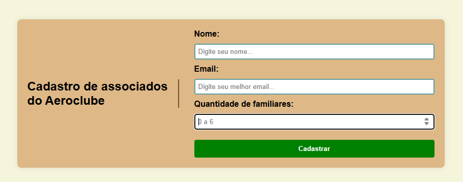

# Formulário de Cadastro de Associados - Aeroclube  

  

  

Este é um projeto **autoral**, desenvolvido por iniciativa própria para praticar e aplicar os conhecimentos que venho adquirindo em **HTML** e **JavaScript**.  
A proposta de criar um formulário de cadastro para associados de um aeroclube surgiu como um desafio pessoal, com o objetivo de treinar desde a estrutura da página até a lógica de cálculo da mensalidade. 

---

## 🔗 Acesse o projeto online  

Você pode acessar e testar o formulário diretamente pelo GitHub Pages, no link disponível no canto superior direito do repositório ou <a href="https://iamandaleao.github.io/aeroclub-member-registration/">clicando aqui</a>.  

---

## ✨ Funcionalidades  

- **Validação de Nome**: aceita até 100 caracteres.  
- **Validação de Email**: aceita apenas emails válidos, até 100 caracteres.  
- **Quantidade de Familiares**: aceita números entre 0 e 6.  
- **Botão Cadastrar**: ao ser clicado, exibe mensagem com o valor da mensalidade calculada.  

---

## 💰 Cálculo da Mensalidade  

A mensalidade base é **R$150**, com acréscimo de **R$30 por familiar adicional**.  

Exemplos:  
- 0 familiares → R$150  
- 2 familiares → R$210  

---

## 👩‍💻 Sobre o Projeto  

Este projeto foi criado com os seguintes objetivos:  
- Praticar **HTML semântico** e **JavaScript básico**.  
- Trabalhar conceitos de **validação de formulários**.  
- Implementar **lógica condicional** no front-end.  
- Exercitar autonomia na criação e execução de projetos práticos, sem depender de instruções externas.  

---
